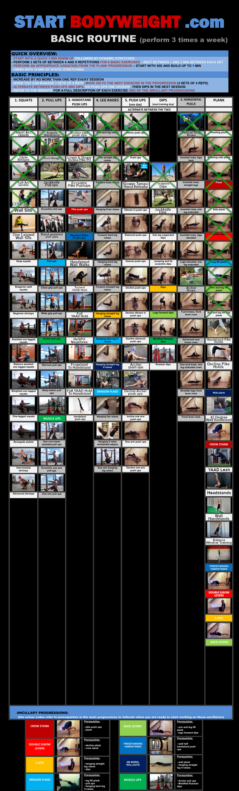

Crossed off X's are removable via opening the `.xcf` file and deleting layers. I just use [Gimp](https://www.gimp.org/).

PDFs are used to allow for higher fidelity zooming.

###### Copyright Disclaimer
This project is for educational and non-commercial purposes only. I do not claim ownership of the original content used in this repository. All rights to the images and information contained herein belong to their respective owners. This includes but is not limited to the main infographic content from startbodyweight.com and other various images sourced from the internet.

The use of these materials in this project is intended to be within the boundaries of fair use as defined under copyright law, which allows limited use for purposes such as criticism, comment, news reporting, teaching, scholarship, or research.

No commercial benefit is derived from this project, and it is not intended to infringe upon the copyrights of the original content owners. If you are the owner of any content included in this project and believe that its use does not fall within the guidelines of fair use, please contact me, and I will remove it promptly.
